### Hello there!

<picture>
  <source media="(prefers-color-scheme: dark)" srcset="./assets/overview.dark.svg" />
  
</picture>

<picture>
  <source media="(prefers-color-scheme: dark)" srcset="./assets/momentum.dark.svg" />
  
</picture>

<picture>
  <source media="(prefers-color-scheme: dark)" srcset="./assets/contributions.dark.svg" />
  
</picture>

<picture>
  <source media="(prefers-color-scheme: dark)" srcset="./assets/lifetime.dark.svg" />
  
</picture>

<picture>
  <source media="(prefers-color-scheme: dark)" srcset="./assets/composition.dark.svg" />
  
</picture>

<picture>
  <source media="(prefers-color-scheme: dark)" srcset="./assets/rhythm.dark.svg" />
  
</picture>

<picture>
  <source media="(prefers-color-scheme: dark)" srcset="./assets/cadence.dark.svg" />
  
</picture>

<picture>
  <source media="(prefers-color-scheme: dark)" srcset="./assets/repositories.dark.svg" />
  
</picture>

<picture>
  <source media="(prefers-color-scheme: dark)" srcset="./assets/portfolio.dark.svg" />
  
</picture>

<picture>
  <source media="(prefers-color-scheme: dark)" srcset="./assets/languages.dark.svg" />
  
</picture>

  <a href="https://github.com/rtf6x"><picture>
    <source media="(prefers-color-scheme: dark)" srcset="./assets/badges/github.dark.svg" />
    
  </picture></a>
  <a href="https://www.npmjs.com/~rtf6x"><picture>
    <source media="(prefers-color-scheme: dark)" srcset="./assets/badges/npm.dark.svg" />
    
  </picture></a>
  <a href="https://www.typescriptlang.org/"><picture>
    <source media="(prefers-color-scheme: dark)" srcset="./assets/badges/typescript.dark.svg" />
    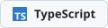
  </picture></a>

